<!-- _class: lead -->

# Analytics Engineering: Session 17

## Materializations, Incremental Models & Snapshots

---

## Goal

Understand when to use each materialization and how to capture historical changes.

**By the end of this session you will have:**

1. A mental model for choosing view, table, ephemeral, or incremental
2. `mart_daily_sessions` — an incremental model aggregating website traffic by day
3. `customer_snapshot` — a check-strategy snapshot tracking SCD2 customer history
4. A live demo showing how `dbt snapshot` captures a real attribute change

---

## Checklist

- [ ] `models/marts/mart_daily_sessions.sql` — incremental model on `stg_website_sessions`
- [ ] `snapshots/customer_snapshot.sql` — `check`-strategy snapshot on `source('raw', 'customers')`
- [ ] `dbt build -s mart_daily_sessions` passes on first and second run
- [ ] `dbt snapshot` captures a live attribute change — two rows for the mutated customer

---

## Materializations — the four options


---

## View

The default for `staging/`. dbt runs the SQL as a query every time another model `ref()`s it — nothing is written to the warehouse.

- No storage cost, always reflects the latest source data
- Slow on large datasets — every downstream query re-runs the SQL

```sql
{{ config(materialized='view') }}
```

---

## Table

The default for `intermediate/` and `marts/`. dbt drops and recreates the table on every `dbt run`.

- Fast queries — data is materialized to the warehouse
- Stale until the next run
- Expensive on large tables — full rebuild every time, even if nothing changed

```sql
{{ config(materialized='table') }}
```

---

## Ephemeral

No database object is created. dbt inlines the model's SQL as a CTE inside every model that `ref()`s it.

- Zero storage cost — no warehouse object
- **Cannot** be queried directly from a database client
- Useful for reusable logic that should not be a standalone table

```sql
{{ config(materialized='ephemeral') }}
```

---

## Overriding the project default

The project sets a default materialization for every layer in `dbt_project.yml`:

```yaml
models:
  dbt_ie:
    marts:
      materialized: table   # applies to all marts
```

A `{{ config() }}` block at the top of a model overrides it:

```sql
{{ config(
    materialized='incremental',
    unique_key='session_day'
) }}
```

**Model-level `config()` always wins over the project default.**

---

## Why incremental?

Every `dbt run` rebuilds every model from scratch by default.

For a table with **100M rows**, a full rebuild processes all 100M rows — even if only 50K new rows arrived yesterday.

Incremental models solve this:

- **First run** — `is_incremental()` returns false: full table built from scratch
- **Subsequent runs** — `is_incremental()` returns true: only new or updated rows processed

**Result**: build time drops from minutes to seconds on large tables.

*This dataset is teaching-sized — but the pattern scales to any volume.*

---

## is_incremental()



---

## The model in context


The dashed arrow shows `{{ this }}` feeding a filter back into the staging step — only when the table already exists.

---

## `{{ this }}` — how the filter is built

```sql
{{ config(materialized='incremental', unique_key='session_day') }}

with sessions as (
    select
        cast(session_date as date) as session_day,
        converted,
        source
    from {{ ref('stg_website_sessions') }}
    
    -- {{ this }} resolves to the schema + table at compile time
    where cast(session_date as date) > (select max(session_day) from {{ this }})
    
)
...
```

`{{ this }}` is a Jinja reference that dbt resolves to the model's own existing table. Run `dbt compile -s mart_daily_sessions` to see what it compiles to.

---

## Incremental config keys

<style scoped>table { font-size: 0.82em; }</style>

| Key | Purpose |
|-----|---------|
| `materialized` | Set to `'incremental'` |
| `unique_key` | Column(s) to merge on — prevents duplicate rows |
| `incremental_strategy` | `append` / `merge` / `delete+insert` (DuckDB default: `merge`) |
| `on_schema_change` | What to do if the model's columns change |

---

## Incremental strategies

<style scoped>table { font-size: 0.82em; }</style>

| Strategy | What it does | Best for |
|----------|-------------|---------|
| `append` | Insert new rows only — no deduplication | Immutable event streams |
| `merge` | Upsert on `unique_key` — updates existing rows | Most use cases |
| `delete+insert` | Delete matching rows, then re-insert | Partitioned tables |

Default on DuckDB: **`merge`**. Requires `unique_key`.

---

## `--full-refresh` and `on_schema_change`

Force a full rebuild at any time:

```bash
dbt run -s mart_daily_sessions --full-refresh
```

`on_schema_change` controls what happens when the model's column list changes:

<style scoped>table { font-size: 0.82em; }</style>

| Value | Behavior |
|-------|---------|
| `ignore` (default) | Silently ignore new columns |
| `append_new_columns` | Add new columns to the existing table |
| `sync_all_columns` | Add and remove columns to match the model |
| `fail` | Raise an error — force a deliberate decision |

---

## Three scenarios at a glance

<style scoped>table { font-size: 0.82em; }</style>

| Scenario | Command | `is_incremental()` | What happens |
|----------|---------|-------------------|-------------|
| **First run** | `dbt run -s mart_daily_sessions` | `false` — table doesn't exist | Full source scan · table created |
| **Subsequent run** | `dbt run -s mart_daily_sessions` | `true` — table exists | Filtered scan · rows merged on `session_day` |
| **Force rebuild** | `dbt run -s mart_daily_sessions --full-refresh` | `false` — flag overrides | Full source scan · table dropped and recreated |

The `--full-refresh` flag is the escape hatch: it tells dbt to treat the model as if it's the first run, regardless of whether the table exists.

---

## Real data: dates are strings

Source date columns in this dataset are `VARCHAR`, not `DATE`.

```sql
-- ❌ type mismatch — session_date is a VARCHAR
where session_date > (select max(session_day) from {{ this }})

-- ✓ cast before comparing
where cast(session_date as date) > (select max(session_day) from {{ this }})
```

Always cast before using a string date in an incremental predicate.

---

## Exercise 1 — `mart_daily_sessions` (20 min)

Create `models/marts/mart_daily_sessions.sql` using `{{ ref('stg_website_sessions') }}`.

Configure:

- `materialized='incremental'`
- `unique_key='session_day'`
- `on_schema_change='append_new_columns'`

Add an `` filter using `cast(session_date as date)`.

---

## Exercise 1 — output columns (cont.)

<style scoped>table { font-size: 0.78em; }</style>

| Column | Description |
|--------|-------------|
| `session_day` | `session_date` cast to `date` |
| `sessions` | Total sessions |
| `conversions` | Sessions where `converted = true` |
| `conversion_rate` | `conversions / sessions * 100`, rounded to 2 d.p. |
| `unique_sources` | Distinct values of `source` |

---

## Verify — three scenarios

**① First run** — `is_incremental()` is false, full table built:
```bash
dbt build -s mart_daily_sessions
```

**② Subsequent run** — `is_incremental()` is true, only new rows merged:
```bash
dbt build -s mart_daily_sessions          # run again, same data
```

**③ Force rebuild** — drop and recreate from scratch:
```bash
dbt build -s mart_daily_sessions --full-refresh
```

After each run, inspect the compiled SQL to see the predicate change:
```bash
dbt compile -s mart_daily_sessions
# check target/compiled/dbt_ie/models/marts/mart_daily_sessions.sql
```

---

## Snapshots — capturing history

Incremental models track **new rows**. But what if a customer's `customer_segment` changes from `regular` to `enterprise`?

With `merge` on `customer_id`, dbt **overwrites** the old value — history is lost.

**Snapshots** solve this:

- On each `dbt snapshot` run, dbt compares the current source against the previous snapshot
- Changed rows get a new record; the old row is **closed** with a `dbt_valid_to` timestamp
- This pattern is called **Slowly Changing Dimension Type 2 (SCD2)**

Unlike models, snapshots live in `snapshots/` and run with `dbt snapshot`.

---

## Snapshot anatomy


`dbt_valid_from` — when this row became active &nbsp;·&nbsp; `dbt_valid_to` — when it was closed (`null` = current row)

---

## Strategy: timestamp vs check

<style scoped>table { font-size: 0.82em; }</style>

| Strategy | How it detects changes | Requires |
|----------|----------------------|---------|
| `timestamp` | Compares `updated_at` column between runs | A reliable `updated_at` in the source |
| `check` | Hashes the values in `check_cols` each run | A list of columns to watch |

Our `customers` source has no `updated_at` → we use **`check`**.

`check_cols` accepts a list of column names or `'all'` to compare every column.

---

## The `` block

```sql


{{ config(
    target_schema='snapshots',
    unique_key='customer_id',
    strategy='check',
    check_cols=['customer_segment', 'country']
) }}

select * from {{ source('raw', 'customers') }}


```

File location: `snapshots/customer_snapshot.sql` &nbsp;·&nbsp; Run with: `dbt snapshot`

`select *` here is intentional — snapshots capture the full source state verbatim.

---

## Exercise 2 — `customer_snapshot` (15 min)

1. Create `snapshots/customer_snapshot.sql` as shown above
2. Run `dbt snapshot` — confirm `snapshots.customer_snapshot` has one row per customer
3. Open a DuckDB session and update a customer's segment:

```sql
update main.customers
   set customer_segment = 'enterprise'
 where customer_id = 1;
```

4. Run `dbt snapshot` again
5. Query the snapshot and confirm two rows exist for `customer_id = 1`

---

## Verify

```bash
dbt snapshot   # initial capture — one row per customer
# update main.customers as above
dbt snapshot   # captures the change
```

Query to confirm SCD2 captured the change:

```sql
select customer_id, customer_segment, dbt_valid_from, dbt_valid_to
from snapshots.customer_snapshot
where customer_id = 1
order by dbt_valid_from;
```

To reset the database at any point: `python create_db.py`

---

## Bonus

- Change `check_cols` to `'all'` in `customer_snapshot` — does behavior change?
- Update a column **not** in `check_cols` (e.g., `first_name`) and run `dbt snapshot` — confirm no new row is created
- Change the incremental strategy in `mart_daily_sessions` to `delete+insert` — compare the compiled SQL
- Add `on_schema_change='fail'` to `mart_daily_sessions`, add a new column, then run `dbt build`

---

## What have we learned in this session

- **Materializations**: view, table, ephemeral trade-offs; model-level `{{ config() }}` overrides the project default
- **Incremental**: `is_incremental()`, `unique_key`, `merge` strategy, `--full-refresh`, `on_schema_change`, casting `VARCHAR` dates
- **Snapshots**: SCD2 concept, `check` strategy, `dbt_valid_from` / `dbt_valid_to`, `dbt snapshot` command

**Next Session:** Certification Preparation & Review
